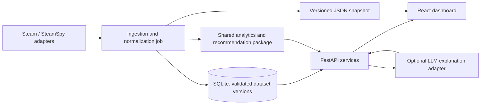

# Indie Launch Intelligence architecture

Status: the Steam game-inspection API and Python package manifests are implemented.
The snapshot-input baseline, recommendation POST endpoint, selected-app Steam CLI,
CSV-to-SQLite catalog, and frontend Steam-link report flow are also implemented;
see the [model card](../ml/MODEL_CARD.md).
Bulk upcoming discovery, versioned dashboard datasets, trained models, deployment
files, and generated frontend clients are still to be implemented.

## System shape

Use one monorepo, one React + TypeScript web application, one Python FastAPI API,
and a separately invoked Python ingestion job. Keep the main recommendation model
in a shared Python package imported by both the API and pipeline. Start with an
explainable scoring baseline; a trained model can later implement the same interface.
An LLM is an optional explanation adapter behind the API, not the scoring engine.



## Target file architecture

Directories exist now; named implementation files below are the intended build map,
not a claim that those files already exist. Each Python application/package gets its
own `pyproject.toml` and source layout. Use one root Python workspace lockfile and
one frontend package lockfile once dependencies are selected and installed.

```text
team-Obsidian/
├── README.md
├── CODE_OF_CONDUCT.md
├── .gitignore
├── .env.example                       # API/job config; names only, no secrets
├── pyproject.toml                     # Python workspace and shared lint/test settings
├── uv.lock
├── apps/
│   ├── web/
│   │   ├── package.json
│   │   ├── package-lock.json
│   │   ├── vite.config.ts
│   │   ├── tsconfig.json
│   │   ├── index.html
│   │   ├── public/data/snapshot.json   # published, validated real-data fallback
│   │   └── src/
│   │       ├── main.tsx
│   │       ├── app/{App.tsx,providers.tsx,styles.css}
│   │       ├── features/
│   │       │   ├── saturation/{Heatmap.tsx,useSaturation.ts}
│   │       │   ├── competitors/{Timeline.tsx,useCompetitors.ts}
│   │       │   └── recommendations/{LaunchCard.tsx,useRecommendations.ts}
│   │       ├── components/{GenreSelector.tsx,DataStatus.tsx,EmptyState.tsx}
│   │       └── lib/api/{client.ts,generated.ts,snapshot.ts}
│   └── api/
│       ├── pyproject.toml
│       ├── src/ili_api/
│       │   ├── __init__.py
│       │   ├── main.py                # app factory, CORS, exception handlers
│       │   ├── settings.py            # environment config and secret loading
│       │   ├── dependencies.py        # repository/model/provider injection
│       │   ├── schemas.py             # HTTP request/response models
│       │   ├── routes/{health.py,market.py,recommendations.py}
│       │   ├── services/{market.py,recommendations.py}
│       │   └── llm/{base.py,service.py,prompts.py} # later: provider adapters
│       └── tests/
├── pipelines/
│   ├── pyproject.toml
│   ├── src/ili_pipeline/
│   │   ├── __init__.py
│   │   ├── cli.py                     # collect / analyze / export / refresh
│   │   ├── refresh.py                 # orchestration, run lock, atomic publication
│   │   ├── sources/{base.py,steam.py,steamspy.py}
│   │   ├── transforms/{normalize.py,validate.py}
│   │   └── export.py                  # JSON dashboard snapshot + analysis CSV
│   └── tests/
├── packages/core/
│   ├── pyproject.toml
│   ├── src/ili_core/
│   │   ├── __init__.py
│   │   ├── domain/{games.py,datasets.py,recommendations.py}
│   │   ├── analytics/{calendar.py,saturation.py,features.py}
│   │   ├── recommendation/{base.py,baseline.py,policy.py}
│   │   └── storage/{base.py,sqlite.py,migrations/}
│   └── tests/
├── contracts/
│   ├── README.md                      # integration contract defined now
│   ├── openapi.json                   # generated from API; never hand-edited
│   └── snapshot.schema.json           # generated from validated snapshot models
├── ml/
│   ├── README.md
│   ├── experiments/                   # research notebooks; no runtime imports
│   ├── evaluation/                    # time-based backtests and reports
│   └── artifacts/                     # ignored local model files and metadata
├── data/
│   ├── README.md
│   ├── raw/                           # ignored source responses
│   ├── processed/                     # ignored SQLite and CSV exports
│   └── snapshots/                     # ignored candidate/versioned snapshots
├── docs/{ARCHITECTURE.md,TEAM_WORKFLOW.md,HACKATHON.md}
├── infra/                             # later: Dockerfiles and deployment config
├── scripts/                           # repeatable setup/export/demo commands
├── tests/e2e/                         # dashboard, API, and offline integration
└── .github/workflows/                 # later: lint, tests, builds, contract checks
```

## Dependency rules and ownership

| Boundary | Owner | Responsibility | Allowed dependencies |
| --- | --- | --- | --- |
| `apps/web` | Frontend | Charts, filters, loading/error states, snapshot selection | HTTP contracts and exported snapshot |
| `apps/api` | Backend | Validate requests, orchestrate reads and inference, serialize results | `ili_core`, optional server-side LLM provider |
| `pipelines` | Backend with ML review | Source access, retries, normalization, dataset publication | `ili_core`; never API route code |
| `packages/core/domain` | Backend + ML | Canonical typed entities and interfaces | Python/domain validation only |
| `packages/core/analytics`, `recommendation` | ML engineer | Features, scoring, abstention, model versions | Domain; no HTTP, UI, DB queries, or provider calls |
| `packages/core/storage` | Backend | Repository interface, SQLite adapter, migrations | Domain and database driver |
| `ml` | ML engineer | Experiments, evaluation, artifact metadata | Core; production never imports notebooks |
| `contracts` | Backend + frontend + ML | Versioned handoff contracts | Generated from API/core models |

Routes call services. Services load canonical data through repository interfaces,
then pass feature records to pure scoring code. Pipeline exports use that same code.
The browser never recalculates scores or calls Steam/LLM APIs directly.
Split domain, persistence, and model code into separate distributions only if reuse or
independent releases justify it; do not create a microservice for each folder.

## Data lifecycle and storage

1. Collect a bounded sample with explicit source filters and release horizon. Upcoming
   release discovery must be separate from historical popularity enrichment: a popular
   game sample alone cannot establish upcoming market coverage.
2. Retain source, retrieval time, raw release text, and date precision. Normalize by
   Steam app ID; preserve many-to-many tags. Action, Strategy, and Cozy are dashboard
   segments defined by a versioned mapping, not necessarily equivalent source genres.
3. Validate into a candidate dataset. Distinguish missing values from observed zeros.
   Quarantine invalid records and report counts/reasons. Do not turn missing dates
   or vague dates such as “Q4” into invented daily releases.
4. Store immutable logical dataset versions: `dataset_runs`, `game_observations`,
   `game_segments`, `weekly_metrics`, and a single `active_dataset` pointer. Key
   observations by `(dataset_id, app_id)` and metrics by `(dataset_id, segment_id,
   week_start)`. A request reads one dataset ID and uses it throughout.
5. Publish only after validation and aggregation succeed. Swap the active pointer in
   a short transaction. Export snapshots to a temporary file, validate, then atomically
   replace the published file. Keep the previous valid export on failure; include the
   dataset ID so clients can identify different API and snapshot versions.
6. SQLite is canonical for the local application; CSV is an analysis export and JSON
   is the browser fallback. Do not maintain three independently editable sources of truth.

Use one ingestion writer, short transactions, a busy timeout, and local persistent
storage. SQLite WAL supports concurrent readers with a single writer; do not put
the database on a shared network filesystem. Move to PostgreSQL when multiple
writers, replicas, or deployment constraints require it. See
[SQLite isolation](https://www.sqlite.org/isolation.html) and
[WAL documentation](https://www.sqlite.org/wal.html).

## Main model: explainable baseline first

Interface: `rank_windows(feature_rows, policy) -> RecommendationResult`.
Each feature row is identified by dataset, segment, and Monday week-start date.
Policy specifies horizon, coverage gate, feature weights, and version. Output includes
ranked windows, component contributions, evidence IDs, quality flags, and model version.

For the MVP, rank eligible weeks by observed genre release count (ascending), with
deterministic earliest-date tie-breaking and tied ranks disclosed. Call this an observed
competition baseline, not a success predictor. All-zero or insufficiently covered
horizons produce insufficient evidence, not a confident best week. The ML engineer
must document a coverage gate tied to the actual discovery process before enabling
recommendations; record count alone is not proof of coverage.

Later, add competitor strength only when comparable signals exist across the horizon.
Normalize components before weighting; player counts and review counts have different
scales. Upcoming games may have neither signal, so absence must not imply weakness.
Do not claim player availability from historical concurrent-player counts. Percentage
comparisons require a nonzero, explicitly named reference and the same dataset/segment.

Evaluate stability, missingness sensitivity, and time-based holdouts before promoting
a learned ranker. Historical backtests may use only observations available at the
decision date; today's reviews are future leakage for an old launch recommendation.
Record training cutoff, feature schema, dataset IDs, artifact checksum, and metrics.
Retain the baseline as a fallback if a model cannot load or fails compatibility checks.

## Future LLM layer

Add optional explanation generation after deterministic recommendations work. Pass
structured results and selected evidence through a provider interface; keep keys on
the server. Return the canonical scores unchanged, validate referenced evidence IDs,
and restrict prompts to supplied facts. Treat game descriptions as untrusted content.
Use a short timeout, bounded output/cost, and a cache keyed by dataset, model, filters,
and prompt version. On failure, use a deterministic explanation template.

Do not let an LLM assign release dates, alter rankings, execute SQL, or refresh data.
Add embeddings/vector search only for an actual semantic search requirement. A future
chat assistant should call narrow read-only tools backed by the same services.

## Reliability and offline behavior

- Live source access occurs in the job, never during a dashboard read request.
- Show dataset time, source mode, sampled coverage, and stale/incomplete warnings.
  “API available” does not mean “freshly scraped.”
- If an API request fails, switch the entire dashboard to one validated snapshot;
  do not mix live recommendations with cached heatmap cells. Indicate fallback mode.
- Snapshot exports include all supported MVP segment/horizon results. Disable filters
  outside that range rather than inventing results. Synthetic fixtures are labeled and
  confined to development/tests; never silently replace real observations.
- No-internet operation works when the frontend/API or static built assets are served
  locally. A JSON file alone cannot make a remotely hosted app load offline. Add a
  service worker/app-shell cache later if remote-hosted offline reload is required.
- Keep refresh a CLI action during the sprint. A later web-triggered refresh requires
  an authenticated admin endpoint, a durable job ID, rate limiting, and single-flight
  execution. A dashboard “Reload” button only rereads published data.

## Deployment and growth

MVP: serve React build assets locally or on static hosting; run a single API and
scheduled/manual pipeline on a host with persistent SQLite storage. Configure the API
URL and explicit CORS origins; do not assume a static host can run Python or retain a DB.
No containers are needed to agree on the architecture; add reproducible deployment
files when there is working code to package.

Next: scheduled refresh, observability, versioned migrations, LLM explanations, and
time-based evaluation. Later: PostgreSQL, object storage for datasets/model artifacts,
durable workers, authentication/saved projects, and extra market adapters as needed.
Introduce separate inference hosting only when model resources or latency justify it.

FastAPI is proposed for Python-native validation and OpenAPI export, enabling a
generated TypeScript client instead of parallel hand-maintained HTTP types. See the
[official client generation guide](https://fastapi.tiangolo.com/advanced/generate-clients/).
